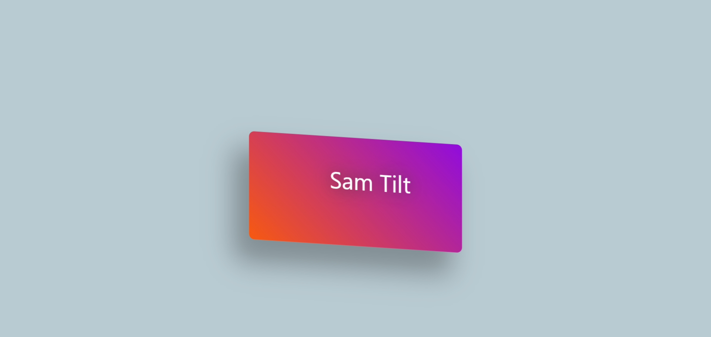

 <div dir="rtl">



 # sam tilt library 
### این کتابخونه چیست؟

 این کتابخونه ساخته شده تا شما بتوانید افکت های زیبا در سایت خود استفاده کنید، افکت هایی مثل:

 - افکت کارت سه بعدی
 - افکت چرخش(درحال ساخت) 

> این کتابخونه *تازه تاسیس* است برای همین ما سعی داریم با کمک شما دوستان این کتابخونه رو بهتر میکنیم، این کتابخونه در آینده فیچر های جدید بهش اضافه میش
  
  ## چجوری نصبش کنیم
  
  فعلا از طریق همین ریپوزیتوری میتونید این کتابخونه رو دانلود کنید

  کتابخونه فایل samTilt.js رو رفرنس بدید به فایل پروژتون و بریم برای ادامه کار ...

  ## آموزش استفاده
 
در اینجا کتابخونه رو صدا میزنیم و قیمت پایین ازش استفاده میکنیم
 </div>


   ```html
  <script src="./samTilt.js" type="module"></script>
  ```

   ```html
  <script type="module">
      import {samTilt} from "./samTilt"
  </script>
  ```

 <div dir="rtl"> 

  ## شخصی سازی کردن

 پارامتر های فعلی برای شخصی سازی:

- elem
- elemItem
- sensitive
- shadowSize
- scale
- reset
- shadow
- shadowSensitive
- glareSize
- justX
- justY
- zoom 


 </div>
 
  ```html
<script type="module">
import {samTilt} from "./samTilt"

 SamTilt({
  elem:'.elem',
  elemItem:'.elemItem',
  sensitive:200,
  shadowSize:50,
  scale:1,
  reset:true,
  shadow:true,
  shadowSensitive: 60,
  glareSize :.2,
  justX:false,
  justY:false,
  zoom :true,
})
</script>
  ``` 

 > نکته مهم اینه که باید رو یک لوکال هاست یا لایو سرور اجرا کنید